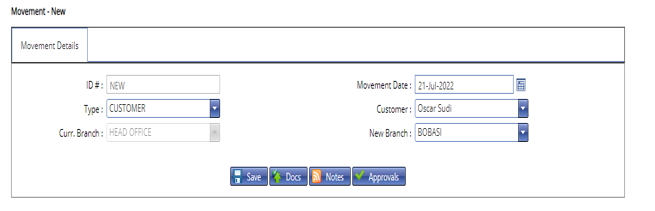

# How to make Branch Movements

***Branch Movements***

- On the main menu click on customer transactions.
- On the drop down menu select branch movements.
- On the customer branch movements page click on new movement at the top left bar. 
- On the new page enter  the type to move i.e. customer, customer group. 
- Enter the name of the customer/group to move.
- The system automatically generates the current branch for the above.
- Enter the new branch. 
- Click on the save button.
