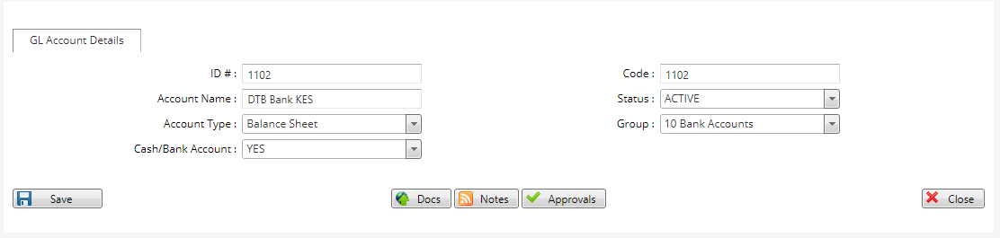

# Creating GL Accounts
\
***Creating GL Accounts***

- On the main menu click on General setup tab.
- On the pop up menu that appears click the GL Account tab.
- On the GL Account page that opens click on the New GL Account tab at the top left bar.
- on the new page enter a new code for the account.
- key in the name of the GL Account I.e DTB Bank KES.
-  select the status of the account as Active.
-  Select the Account Type I.e Balance sheet.
-  Select the group into which the group belongs I.e Bank accounts.
-  Select the as a Cash/Bank account by ticking the Yes button.
-  Click on the save button.
