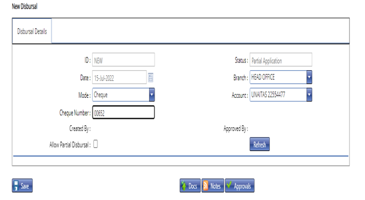
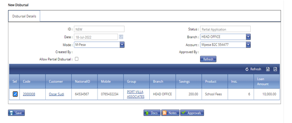

# How to make Loan Disbursals
\
***How to make a Loan Disbursal***

- On the main menu click on customer setup tab.
- On the drop down menu select loan disbursal.
- On the loan disbursal page click on the new disbursal tab.
- On the new page that appears select the branch.
- Select the mode of disbursal.
- Click on the refresh button.
- 
***How to make a Loan Disbursal***

- All loans which fall under the select mode will appear below.
- Select the loan/s for disbursal by ticking on them.
- Click on the save button.
