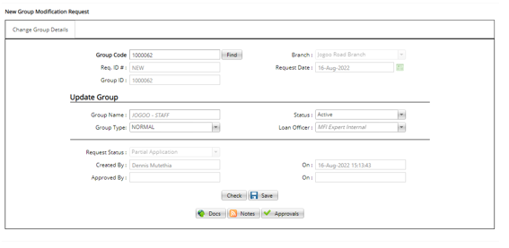

# How to make Group Modification
\
***Group Modifications***

- On the main menu click on customer setup tab.
- On the drop down menu click on the group modification tab.
- On the group modification page click on the new modification tab at the top left bar.
- On the new page key in the group code from the existing groups list and click on find.
- The system automatically populates the group’s data as shown above.
- Update or modify the necessary fields. 
- Click on the save button. 
- Under the Docs tab at the bottom upload any necessary documents.