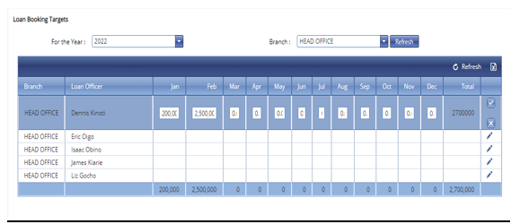

# Loan Officer Targets
\
***Setting up Targets for Loan Officers***

- On the main menu click on customer setup tab.
- On the drop down menu select loan officer targets tab.
- On this page a list of all loan officers will appear.
- Click on the write icon on the far right of the row.
- Enter the loan targets for each officer monthly.
- Check the tick button to save. 
