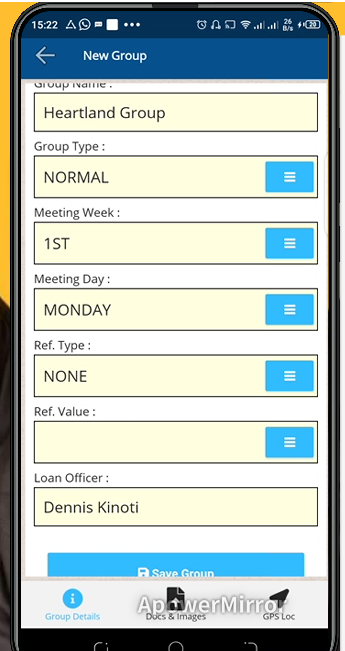

# New Customer Group
\
***Creating a New Customer Group***
- Open your mfi expert app on your mobile device.
- Log in into your user account.
- On the user interface click on groups at the top left of the screen.
- On the new group page select the region for the group.
- Select the branch. 
- Select the ward.
- Enter the group name.
- Indicate the group type.
- Indicate the meeting week for the group.
- Enter the meeting day.
- Indicate the referral type.
- Enter the referral id under referral value.
- Click on the save group button to create the group.
- At the bottom of the screen click on the docs & images to upload documents.
- On the upload document page specify the document category.
- Select the document to upload from your phone storage or take a photo via camera.
- Click on the upload button. 
- Again at the bottom right of the screen click on Gps Loc.
- On the new screen click on get co-ordinates.
- Click on save group location.
- Once the co-ordinates are saved go back to the group details tab .
- Click on submit for approval button.
