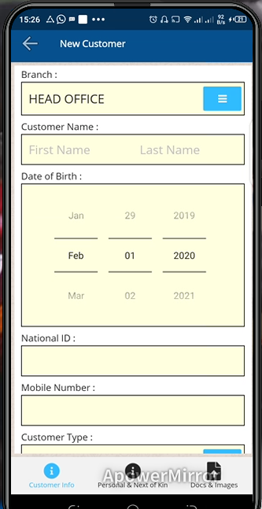

# New Customer
\
***Creating a New Customer Account***

- On the primary page click on customer tab.
- On the new customer screen enter the customer’s region.
- Indicate the branch.
- Select their ward.
- Enter the customer full name.
- Enter the date of birth.
- Enter the national ID.
- Indicate the customer mobile number.
- Select the customer type.
- If the customer is a group member indicate the group name.
- Enter the group designation.
- Indicate the referral type .
- Type in the referral value.
- Click on the Next Page button below.
- On the next page indicate the gender.
- Select the marital status.
- Enter the spouse details with reference to the marital status.
- Indicate the next of kin relationship.
- Type in the name of the kin.
- Key in the national ID of the kin.
- Enter the kin contact.
- Click on the save customer button to create the customer.
- Click on the Docs & Images button at the bottom right of the screen.
- Enter the document category.
- Select the document under phone storage or take a photo via camera.
- Click on the upload button.
- Click on the customer info button. 
- Click on the submit for approval button.
