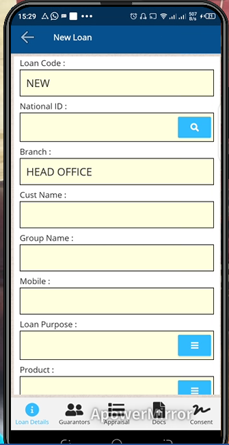

# New_Loan
\
***Creating  new loan on the mobile app***
- On the primary page click on the loan tab.
- Enter the national ID number of the customer and click on the search button.
- The system automatically generates the customer details.
- Select on the loan purpose.
- Indicate the product to finance.
- Enter the loan amount.
- Indicate the number of installments for repayment.
- Select the mode of disbursal.
- Enter the referral type.
- Indicate the referral type respectively.
- Click on the save loan button.
- At the bottom of the screen click on the Guarantors button.
- On the new page that opens there is a list of all the group members.
- Select those chosen as guarantors.
- Click on the save button.
- Again at the bottom of the screen click on the appraisal button. 
- Fill in the appraisal form if necessary.
- Click on the save button.
- Click on the consent button at the bottom of the screen.
- The customer will consent via signature. 
- Click on the save button.
- Click on the submit for approval button.
