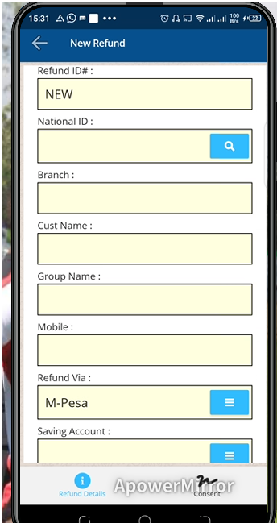

# Refunds

***How to Perform Refunds on the Mobile app***
- On the main page click on the refunds button.
- On the new refund page enter the national ID of the customer and click on the search tab.
- The system automates the customer details.
- Indicate the refund mode.
- Enter the amount to refund.
- State the reason for refund. 
- Click on the refund button.
- At the bottom of the screen click on the co- ent button.
- The customer confirms via signature or fingerprint.
- The group officials also approve if the customer belongs to one.
- Click on the save button. 
- Click on the submit for approval button.
