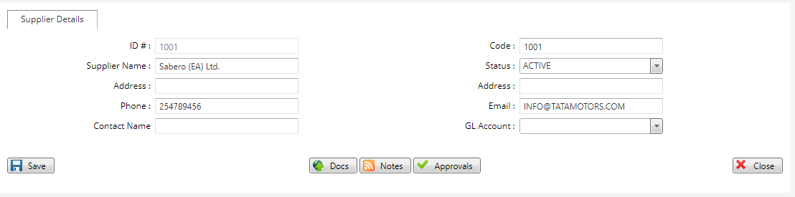

# Setting Up Suppliers
\
***How to Setup Suppliers***
- On the main menu click on general setup tab.
- On the general setup tab drop down click on Supplier Setup tab.
- On the Supplier Setup page click on new Supplier Setup at the top left bar.
- On the new Supplier Setup screen enter a new code.
- Enter the Supplier's name.
- Select the status tab to Active.
- Key in the Supplier's phone number.
- Enter the Supplier's email.
- click on  the save button.
